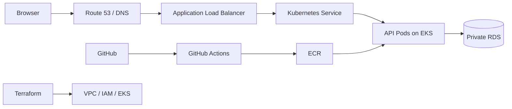

# AWS DevOps: Zero to Production

A hands-on path from first principles to operating an AWS application. Read the mental model, run a small local experiment, then build the [deployable platform](platform/README.md) when ready. This repository is a growing handbook, not a claim that every production system has the same architecture.

> **Cost and security:** AWS labs can incur charges, including resources left idle. Set a budget and alerts before creating anything. Never use the root user for routine work, commit credentials, or assume a lab is free. Run each lab's cleanup and confirm deletion in the AWS console. Terraform state can contain secrets; protect it accordingly.

## Who this is for

Beginners who can install a terminal and want to understand *why* Linux, networks, containers, IAM, Kubernetes and Terraform behave as they do. Operators can use the [runbooks](runbooks/README.md) as starting points, adapted to their systems.

## Learning outcomes

Explain a browser request from DNS through TLS, load balancer, workload and database; build and debug a container; read Kubernetes objects; plan and provision a basic AWS network with Terraform; reason through an incident using evidence.

## Start here

1. [Foundations](docs/01-foundations.md) → [Linux](docs/02-linux.md) → [Networking](docs/03-networking.md).
2. [Git and cloud](docs/04-git-cloud.md) → [AWS and IAM](docs/05-aws-iam.md) → [VPC](docs/06-vpc.md).
3. [Compute, storage and databases](docs/07-compute-data.md) → [Docker lab](labs/01-local-api/README.md) → [Kubernetes](docs/08-kubernetes-eks.md).
4. [Terraform](docs/09-terraform.md) → [VPC lab](labs/02-terraform-vpc/README.md) → [CI/CD](docs/10-delivery.md).
5. [Operations](docs/11-operations.md) → [failure lab](labs/03-failure-lab/README.md) → [deployable platform](platform/README.md) → [capstone design](architecture/capstone.md).

No AWS account is needed for reading or the local Python lab. Docker and Kubernetes are optional until their labs. The Terraform lab needs an AWS account, Terraform, AWS CLI and permission to create its listed resources.

## System map

The [platform implementation](platform/README.md) supplies the AWS infrastructure and deployment path; it has passed static validation but needs verification in a configured AWS account. The [roadmap](ROADMAP.md) tracks remaining work.

## Repository map

| Path | Use |
| --- | --- |
| `docs/` | Ordered explanations and knowledge checks |
| `labs/` | Reproducible exercises and cleanup |
| `terraform/` | Educational, reviewable AWS network configuration |
| `kubernetes/` | Local Deployment and Service example |
| `runbooks/` | Production triage templates |
| `architecture/` | System-level design and tradeoffs |
| `.github/workflows/` | Local checks and OIDC-based platform deployment |
| `platform/` | Deployable EKS, RDS, ECR, Pod Identity and GitHub OIDC path |

## Checkpoints

After networking: diagnose DNS failure versus TCP refusal. After IAM: explain why a valid identity may still receive `AccessDenied`. After Kubernetes: identify why a Service has zero endpoints. After Terraform: distinguish a plan from actual resources and explain what state records.

## Contributing

See [CONTRIBUTING.md](CONTRIBUTING.md). Report security issues via [SECURITY.md](SECURITY.md). Code and text are under [MIT](LICENSE). Examples are educational: review them for your account, region, organization policy and current service versions before production use.
