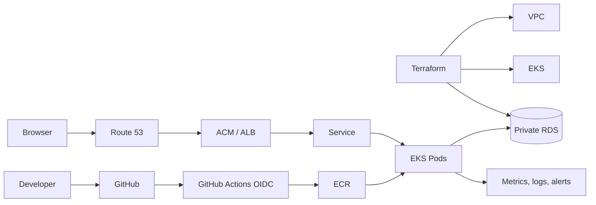

# Production-style capstone design

**Status:** design exercise plus [deployable first platform](../platform/README.md); AWS integration remains unverified. **Difficulty:** advanced. **Cost:** EKS, NAT, load balancing, RDS, storage and data transfer can accrue ongoing charges. Estimate current regional prices and set budgets before building.

Provision VPC subnets across AZs, restricted IAM roles, EKS and a private RDS instance with Terraform modules and protected remote state. Build the API image in CI, test it, push to ECR and deploy by digest. Route HTTPS through ALB with ACM certificate and Route 53 record. Use Pod Identity for AWS access where supported, an external secret source, network restrictions and database TLS. Monitor request success/latency and database capacity; practice a failed rollout and rollback.

**Verification plan:** check identity and region; review Terraform plan; deploy staging; call `/health` through public HTTPS and inspect certificate; verify database write/read using non-sensitive test data; trigger a controlled failure; confirm alert, rollback and restored user path. **Troubleshooting:** trace DNS → TLS → ALB target health → Service endpoints → Pod logs → DB path. **Cleanup plan:** delete DNS record and app resources, empty any buckets/repositories that Terraform cannot destroy automatically, run `terraform destroy` in reverse dependency order, then inspect account for remaining billable resources. Never run this against a production account without a separate change plan.

Knowledge questions: Which layer owns each failure? What is the recovery objective? Which credentials exist at each hop, and how are they rotated?
