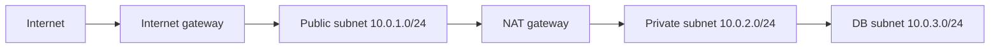

# 3. Networking: follow the packet

An IP address identifies an interface within a routed network. IPv4 has 32 bits; IPv6 has 128. A port identifies a listening service on a host. TCP establishes an ordered connection; UDP sends independent datagrams. A socket is the endpoint formed by address, port and protocol. The OSI model is useful for triage: physical/link, IP routing, transport, then application protocols. Do not treat layer names as a substitute for packet evidence.

`10.0.0.0/16` has 16 fixed network bits and 16 address bits: it spans `10.0.0.0` through `10.0.255.255`. `10.0.1.0/24` fixes 24 bits: `10.0.1.0` through `10.0.1.255`. A `/24` fits inside the `/16`; smaller prefix lengths describe larger ranges. AWS reserves addresses in each subnet, so do not equate address count with usable instances. RFC 1918 private ranges are not Internet routable by themselves. A public address and an Internet route can make a host reachable, subject to firewalls.

A router selects the next hop from its route table, normally preferring the most specific matching prefix. A gateway forwards off the local network. NAT rewrites address information, commonly letting private workloads initiate outbound connections. NAT does not grant inbound access from the Internet. Firewalls filter traffic; AWS security groups are stateful, whereas network ACLs are stateless.

DNS maps a name to records, not directly to application health. HTTP carries methods, headers and status codes. HTTPS adds TLS, which authenticates the server name with a certificate and encrypts traffic after negotiation. A reverse proxy or load balancer may terminate TLS, check backend health and forward traffic. A VPN creates an encrypted network path, but routing, DNS and access controls still matter.

## Diagnose in order

`dig example.com` checks DNS. `ip route get 1.1.1.1` checks route selection on Linux. `ping` tests ICMP only; a failed ping does not prove TCP is blocked. `nc -vz HOST 443` tests TCP reachability. `curl -v https://HOST/health` tests HTTP/TLS. `openssl s_client -connect HOST:443 -servername HOST` inspects a TLS handshake. `ss -ltnp` shows local listeners. `traceroute` offers clues but intermediate routers may suppress replies. `nslookup` is a common alternative to `dig`.

## Knowledge check

Why does a private subnet need an outbound path to fetch packages? Why can DNS resolve while HTTPS fails? Which rule or route would you inspect when traffic reaches an ALB but not a backend?

Further reading: [AWS VPC routing](https://docs.aws.amazon.com/vpc/latest/userguide/VPC_Route_Tables.html), [Kubernetes networking](https://kubernetes.io/docs/concepts/cluster-administration/networking/).
