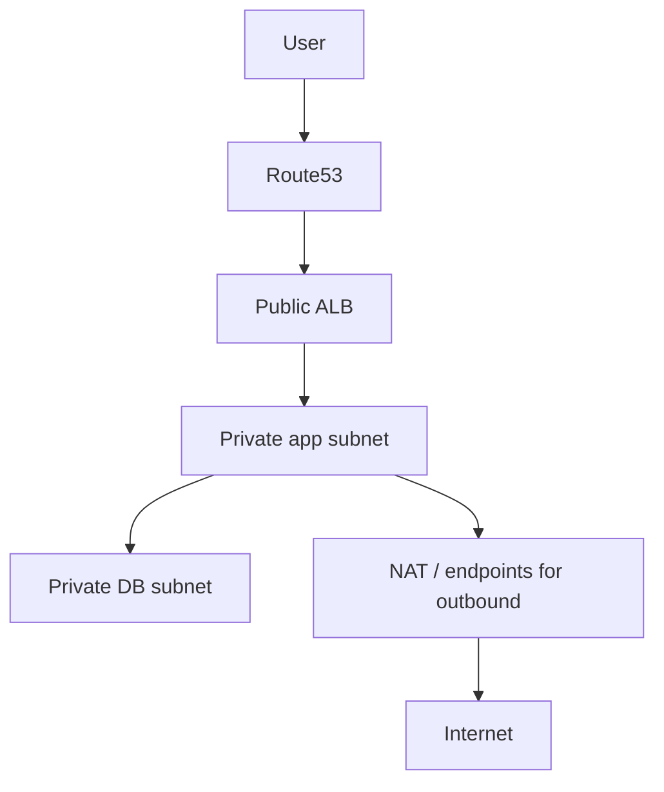

# 6. AWS VPC: routes and boundaries

A VPC is an isolated IP network in one region. Its CIDR block defines possible addresses. A subnet belongs to one AZ and has a route table. “Public subnet” means its effective route table has a default route to an Internet gateway; an instance also needs a public address and permissive security policy to accept Internet traffic. “Private subnet” has no such direct route. A NAT gateway in a public subnet can provide outbound IPv4 for private workloads and incurs hourly and data processing charges. VPC endpoints can avoid some NAT paths for supported AWS services.

Security groups attach to ENIs and are stateful. Network ACLs attach to subnets and are stateless, so return traffic needs rules too. VPC Flow Logs record network-flow metadata; they do not show HTTP contents. VPC peering connects VPCs without transitive routing. Transit Gateway is a hub for larger networks. DNS resolution inside a VPC depends on VPC settings and resolver behavior.

Keep databases private and allow the DB port only from the application security group. This does not replace database authentication or TLS. An ALB may be public while targets stay private. In a real multi-AZ design, duplicate app and database subnets across zones and assess NAT resilience and cost.

## Failure walk

If an app cannot reach RDS: check endpoint and DNS, RDS status, security group source and port, subnet route where relevant, NACL return path, TLS settings and credentials. A TCP timeout suggests network path; an authentication error means TCP reached the database. See [database runbook](../runbooks/database-connectivity.md).

## Knowledge check

Does a public route alone give an instance a public IP? Why can a private workload initiate Internet traffic through NAT but receive no unsolicited inbound connection? What does a stateful security group remember?

Further reading: [VPC user guide](https://docs.aws.amazon.com/vpc/latest/userguide/what-is-amazon-vpc.html), [VPC route tables](https://docs.aws.amazon.com/vpc/latest/userguide/VPC_Route_Tables.html).

Continue with [VPC traffic through the platform](services/vpc-traffic.md).
