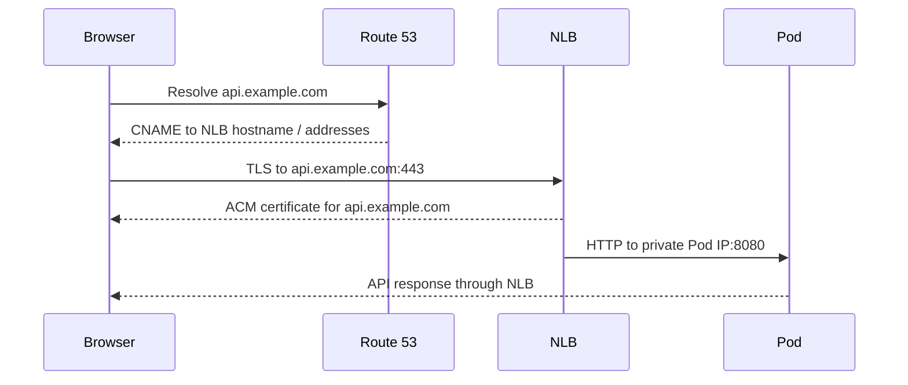

# Route 53, ACM and NLB: how a browser reaches a Pod

Read [networking](../03-networking.md) and [VPC traffic](vpc-traffic.md) first. DNS, TLS and load balancing are three separate systems. DNS finds an address. TLS authenticates a name and encrypts a connection. A load balancer selects healthy backends. A valid certificate does not prove the target application works, and a healthy target does not prove DNS is correct.

## 1. DNS resolution

The browser asks a resolver for `api.example.com`. The resolver may use cached answers until TTL expires. A Route 53 hosted zone is authoritative only if the domain's delegation points to it. A record can be syntactically present in Route 53 yet invisible to public clients when registrar nameservers or parent-zone delegation are wrong. The platform's [DNS helper](../../platform/scripts/publish_dns.py) creates a CNAME from a **subdomain** to the NLB hostname after the Service has created the NLB. A CNAME cannot live at a DNS zone apex. An alias record is possible for an apex with appropriate target details.

When debugging, compare `dig api.example.com`, `dig NS example.com` and a query against the expected authoritative servers. Beware split-horizon DNS: a VPC private hosted zone can answer differently from public DNS. DNS answers do not carry application health unless an explicit health-aware routing policy is configured.

## 2. Certificate request and validation

ACM issues a certificate for the exact hostname after ownership validation. [tls.tf](../../platform/terraform/tls.tf) creates a DNS validation record in an existing public Route 53 zone and waits for validation. The certificate ARN is passed to the NLB Service annotation. A certificate for `api.example.com` does not authenticate the NLB's AWS-generated hostname; call the custom domain over HTTPS to test name validation. Certificates are region-bound for regional load balancers; confirm region alignment.

TLS has several checks: certificate name, validity period, issuer trust chain, client-supported protocols/ciphers and successful handshake. `curl -v https://api.example.com/ready` exposes useful handshake information. `openssl s_client -connect api.example.com:443 -servername api.example.com` can show the presented certificate. Do not “fix” a failure by disabling verification in production code; determine whether DNS, certificate name, chain or listener is wrong.

## 3. NLB listener, target group and health

The platform's Service declares `loadBalancerClass: eks.amazonaws.com/nlb`; EKS Auto Mode provisions a Network Load Balancer. The NLB listener accepts port 80 in the HTTP lab or port 443 with ACM TLS termination. Its target group sends traffic to Pod IPs on port 8080. Kubernetes readiness removes unready Pods from Service endpoints. NLB target health is another layer and may take time to converge. The public subnets need the EKS load balancer role tag, and the private Pods need network reachability from the NLB.

The platform terminates TLS at the NLB; the hop to the Pod is HTTP. For sensitive production traffic, decide whether network controls are sufficient or whether you require TLS to the backend as well. An NLB does not understand HTTP host/path routing. For many web services under one domain, an ALB Ingress can be more appropriate. ALB and NLB have different controllers, annotations, health checks and charging models.

## 4. Failure classification

| User error | Evidence | Likely owner |
| --- | --- | --- |
| `NXDOMAIN` | Authoritative query lacks name | DNS zone/record/delegation |
| TLS name mismatch | Certificate SAN does not include requested host | ACM cert or DNS pointing to wrong LB |
| TLS timeout | TCP 443 not established | NLB listener, SG, route |
| 503 / no target | Target group unhealthy or no endpoints | Service selector, readiness, Pod/RDS |
| `/health` 200, `/ready` 503 | App alive but dependency unavailable | Pod Identity, secret, DB path |

Test each layer from outside the VPC and, when needed, from inside the Pod. A Pod-local `curl` bypasses DNS/NLB and cannot prove the public path. An external `curl` can prove the request reaches the app but may not identify which internal hop caused high latency. Combine evidence.

## Cost and cleanup

NLB time and processed traffic incur charges; Route 53 hosted zones and DNS queries may incur charges; ACM public certificates used with supported AWS integrations may have service-specific pricing considerations. Check current prices for the region and usage. Remove the Kubernetes Service and wait for NLB deletion before destroying VPC subnets. Remove the DNS CNAME and review the ACM certificate/validation records as part of Terraform destroy.

## Knowledge check

1. Why is an ACM certificate ARN alone insufficient to make HTTPS work?
2. Why can `curl` to the NLB hostname fail certificate validation while the custom domain works?
3. What is the difference between Kubernetes readiness and NLB target health?
4. Which part of the path changes if the Service selector is wrong?
5. When would an ALB be a better fit than this NLB?

Official references: [Route 53 DNS concepts](https://docs.aws.amazon.com/Route53/latest/DeveloperGuide/Welcome.html), [ACM DNS validation](https://docs.aws.amazon.com/acm/latest/userguide/dns-validation.html), [EKS Auto Mode NLB](https://docs.aws.amazon.com/eks/latest/userguide/auto-configure-nlb.html), [Elastic Load Balancing overview](https://docs.aws.amazon.com/elasticloadbalancing/latest/userguide/what-is-load-balancing.html).
