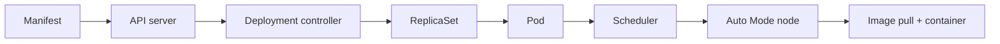

# EKS Auto Mode: from image to healthy request

Read [Kubernetes and EKS basics](../08-kubernetes-eks.md) first. Kubernetes is a desired-state API, not a command that directly starts a container on a particular machine. EKS manages the Kubernetes control plane; EKS Auto Mode additionally manages node provisioning and several integrations. The [platform cluster](../../platform/terraform/cluster.tf) uses Auto Mode, private subnets and the built-in `general-purpose` node pool.

## 1. Objects and controllers

`kubectl apply` or a Helm release sends API objects to the Kubernetes API server. The Deployment controller creates a ReplicaSet. The ReplicaSet creates Pods. The scheduler chooses a suitable node for each unscheduled Pod. Kubelet on the node obtains the image and starts containers. Auto Mode observes unschedulable demand and may provision EC2-backed nodes through its node pools. No single controller executes the whole pipeline.



A Pod is replaceable. Its IP and node can change. A Service offers a stable abstraction and selects Pods by labels; EndpointSlices hold the actual target addresses. A Pod can be Running yet not Ready. The platform's readiness probe calls `/ready`, which checks Secrets Manager and RDS. Liveness calls `/health`, which only checks that the HTTP process responds. This separation prevents a temporary DB outage from repeatedly restarting otherwise healthy processes. The startup probe gives a newly started container time to begin serving.

## 2. Resource requests, limits and scheduling

CPU/memory requests inform scheduling and capacity provisioning. A container with no suitable node remains Pending until capacity appears or constraints change. Memory limits can terminate a process with OOMKilled. CPU limits throttle rather than kill; the platform omits a CPU limit while setting a request. This is a starting point, not a universal performance setting. Observe real utilization and tune. Auto Mode's managed nodes are still billable compute; “managed” is not “free.”

For production replicas, choose a PodDisruptionBudget only after reasoning about actual capacity and drain behavior. `replicas: 2` improves availability only if Pods can land on different failure domains. The chart asks for best-effort zone spreading and one available Pod during voluntary disruption; it does not guarantee AZ-separated Pods. Verify actual node placement and capacity.

## 3. ECR and immutable images

Docker builds layers into an image. ECR stores the image. A tag can be a release label; a digest names exact content. The workflow creates a unique tag, pushes it and deploys by digest. ECR immutable tags prevent accidental overwrite. Scanning on push surfaces findings but does not automatically prove an image safe; review results and rebuild when base images or dependencies change. Nodes need an outbound path or appropriate endpoints to pull from ECR, and IAM permission to authenticate/pull.

If a Pod is `ImagePullBackOff`, identify whether the failure is name/tag, registry authentication, network path or missing architecture variant. `kubectl describe pod` events contain more detail than the phase alone. Do not fix a missing image by widening cluster IAM permissions without evidence.

## 4. Kubernetes versus AWS identity

There are two distinct gates. An operator or CI job needs access to the EKS Kubernetes API via an EKS access entry (and associated policy or RBAC). An application Pod accessing AWS services needs an IAM role, here through Pod Identity. The Deployment uses a dedicated service account `platform-api`; the AWS SDK receives temporary credentials from the association. `automountServiceAccountToken: false` avoids mounting the standard Kubernetes API token because the app does not call that API; EKS Pod Identity supplies its own token mechanism.

The GitHub deploy role has namespace-scoped EKS edit rights. A bootstrap administrator creates namespace `platform`; the CI role then applies ServiceAccount, Deployment and Service there. Creating an EKS cluster does not automatically grant every IAM role Kubernetes permissions. The EKS control plane endpoint in this example is public for bootstrap; API authentication still applies, but a production environment may choose restricted CIDRs or private access with a network path for operators and CI.

## 5. NLB and Service lifecycle

The Service is type `LoadBalancer` with `loadBalancerClass: eks.amazonaws.com/nlb`. EKS Auto Mode interprets it and provisions an NLB in tagged public subnets. The Service uses IP targets so traffic goes to private Pod IPs. It listens on port 80 for a lab without ACM, or 443 with an ACM certificate in the TLS variant. NLB operates at transport level; it does not give HTTP path routing like an ALB. For multiple HTTP services and host/path routing, evaluate an ALB Ingress design.

Deleting a Service can remove its cloud load balancer. Wait for cloud deletion before destroying VPC subnets; otherwise Terraform may fail on resources still attached to those subnets. Inspect Service events and AWS load balancer state if the hostname remains pending. The EKS Auto Mode subnet tags are not decorative: controller discovery depends on them.

## 6. Diagnose an unhealthy rollout

Run these in order after choosing the correct kubeconfig context:

```sh
kubectl config current-context
kubectl get deployment,pods,service,endpointslices -n platform -o wide
kubectl describe deployment platform-api -n platform
kubectl describe pod POD_NAME -n platform
kubectl logs POD_NAME -n platform --previous
kubectl rollout history deployment/platform-api -n platform
```

| State | Typical investigation |
| --- | --- |
| Pending | Node provisioning, scheduling events, resource requests, subnet IP capacity |
| ImagePullBackOff | ECR URI, image digest, node pull permissions, NAT/endpoints |
| CrashLoopBackOff | Prior container logs, exit code, app config, startup probe |
| Running but unready | `/ready`, Pod Identity, RDS path, secret retrieval |
| Service without endpoints | Selector versus Pod labels and readiness |
| NLB has no hostname | Service events, public subnet tags, Auto Mode controller and quotas |

Do not automatically roll back every failure: first check whether the previous application version is compatible with database schema and external dependencies. When rolling back, verify user traffic and data behavior, not just Deployment status.

## Hands-on exercise

Compare Service selector and Deployment Pod labels in [the chart templates](../../platform/chart/README.md). Predict the effect of changing only one label. Run `helm template platform-api platform/chart --namespace platform`, then inspect readiness/liveness/startup probes. In a disposable cluster, use the [failure lab](../../labs/03-failure-lab/README.md) to prove your prediction. Continue with the [Helm deep dive](helm-charts.md).

## Knowledge check

1. Which component creates Pods and which component chooses nodes?
2. Why can `kubectl get pods` show Running while NLB health is bad?
3. What AWS resources must still be available for an image pull into private subnets?
4. What does a digest guarantee that a mutable tag does not?
5. What operational difference separates an NLB Service from ALB Ingress?

Official references: [Kubernetes controllers](https://kubernetes.io/docs/concepts/architecture/controller/), [probes](https://kubernetes.io/docs/concepts/configuration/liveness-readiness-startup-probes/), [EKS Auto Mode](https://docs.aws.amazon.com/eks/latest/userguide/automode.html), [Auto Mode NLB annotations](https://docs.aws.amazon.com/eks/latest/userguide/auto-configure-nlb.html), [EKS access entries](https://docs.aws.amazon.com/eks/latest/userguide/cluster-auth.html).
