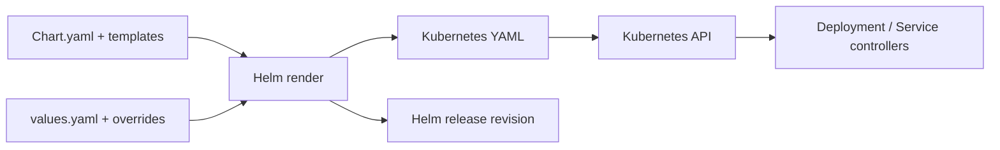

# Helm charts: package, render, release, verify

Read [Kubernetes and EKS](../08-kubernetes-eks.md) first. Helm packages related Kubernetes resources into a *chart*, renders templates with values and manages installed *releases*. It does not replace the Kubernetes API, scheduler or controllers. The [platform chart](../../platform/chart/README.md) is the working example throughout this chapter.

## 1. Why Helm exists

One application often needs a Deployment, Service, ServiceAccount, PodDisruptionBudget, config and test. Copying YAML for every environment creates drift: one copy gets a new probe, another misses it. Helm keeps one set of templates and supplies environment-specific values. It also records release revisions so an operator can inspect and roll back a chart/values combination.

Helm does not provision the VPC, EKS cluster, RDS or IAM role here. Terraform owns those AWS resources. Helm owns the Kubernetes workload resources. The EKS Pod Identity association in Terraform references the ServiceAccount name in the chart; that name is a contract between tools. Changing it in one place breaks the other.



## 2. Chart versus release versus application version

A **chart** is the packaged template source. `Chart.yaml` contains its name, chart `version` and `appVersion`. Chart version changes when packaging/templates/values change. App version describes the application but does not force a particular image unless templates use it. An **image digest** identifies exact container bytes. A **release** is one installation of a chart with chosen values in a namespace. Its revision increments on upgrades and rollbacks. A Deployment also has Kubernetes rollout revisions; those are not identical to Helm release revisions.

Our chart lives in [platform/chart](../../platform/chart/Chart.yaml). The CI release name is `platform-api`, namespace `platform`. The image is supplied as `repository@sha256:digest` by the GitHub workflow, independent of `appVersion`. A new chart version can change a probe without changing image code; a new image can be deployed with the same chart version.

## 3. Chart file anatomy

| File | Purpose in this repo |
| --- | --- |
| [`Chart.yaml`](../../platform/chart/Chart.yaml) | Chart identity and version |
| [`values.yaml`](../../platform/chart/values.yaml) | Default knobs, deliberately fake cloud identifiers |
| [`values.schema.json`](../../platform/chart/values.schema.json) | Type and digest-format validation |
| [`templates/_helpers.tpl`](../../platform/chart/templates/_helpers.tpl) | Reused names and labels |
| [`templates/deployment.yaml`](../../platform/chart/templates/deployment.yaml) | Pods, probes, resources and security context |
| [`templates/service.yaml`](../../platform/chart/templates/service.yaml) | ClusterIP or EKS NLB, optional ACM TLS |
| [`templates/serviceaccount.yaml`](../../platform/chart/templates/serviceaccount.yaml) | Pod Identity name contract |
| [`templates/pdb.yaml`](../../platform/chart/templates/pdb.yaml) | Voluntary-disruption floor |
| [`templates/tests/readiness.yaml`](../../platform/chart/templates/tests/readiness.yaml) | `helm test` request through the Service |

Files under `templates/` use Go templates plus Helm functions. `{{ .Values.replicaCount }}` reads a value. `{{ include "platform-api.labels" . | nindent 4 }}` calls a named helper and indents the generated YAML. `toYaml` renders a structured object such as resource requests. Whitespace trimming (`{{-` and `-}}`) matters: wrong indentation can make valid template syntax produce invalid YAML. Render and inspect output rather than judging templates by eye.

## 4. Values flow and schema

Helm starts with chart defaults, then applies overrides from `-f` files and `--set` flags. Later overrides can replace earlier ones. Values are configuration inputs, not automatically Kubernetes environment variables: a template must explicitly use them. The platform chart's `image.digest` schema requires `sha256:` plus 64 hex characters. This catches a tag accidentally passed as a digest. It cannot prove that ECR contains the image or that the node can pull it.

```sh
helm show values platform/chart
helm lint platform/chart
helm template platform-api platform/chart --namespace platform \
  --set service.type=ClusterIP --set replicaCount=3
```

Changing `service.type` to `ClusterIP` omits cloud load balancer annotations and `loadBalancerClass`. The EKS deployment uses the default `LoadBalancer`. With `service.tls.enabled=true`, a valid ACM certificate ARN is required and the listener becomes port 443. The backend remains HTTP on container port 8080; TLS ends at the NLB. Schema validation guards shape, while `helm lint` and `helm template` catch many rendering errors. None contacts the live target's ECR/RDS path.

Do not put DB passwords or long-lived tokens into values. Values and rendered manifests may be stored with release history and visible to users with access to the release. The chart passes only a secret ARN. EKS Pod Identity grants the Pod temporary AWS credentials; the application fetches the password at runtime. The ARN is an identifier, not the secret value, but still avoid publishing account details unnecessarily.

## 5. Install and upgrade lifecycle

`helm upgrade --install` creates a release when absent and upgrades when present. Helm renders templates, applies resources through the Kubernetes API and stores release metadata. `--wait` waits for selected readiness conditions; `--timeout` bounds the operation. Helm 4 uses `--rollback-on-failure` to return to the previous successful release on a failed upgrade. That is helpful but cannot undo a DB migration, deleted S3 object or incompatible external API change. Review [the deploy workflow](../../.github/workflows/deploy-platform.yml) for the exact commands.

```sh
helm list -n platform
helm status platform-api -n platform
helm get values platform-api -n platform
helm get manifest platform-api -n platform
helm history platform-api -n platform
```

`helm get values` shows configured values; `helm get manifest` shows the rendered Kubernetes resources stored with the release. Compare both with live `kubectl get deployment,service -n platform -o yaml` when debugging drift. The chart is the release source of truth for those resources. Avoid alternating Helm upgrades and manual `kubectl apply` on the same resource: ownership and field changes become hard to reason about.

## 6. Tests, hooks and their limits

Helm test hooks are Kubernetes resources annotated with `helm.sh/hook: test`. This chart's test Pod calls `/ready` through the Service. `helm test platform-api -n platform --logs` reports whether that request succeeded. The hook Pod is removed after success by its deletion policy; a failed test Pod remains to inspect. Hooks run at defined lifecycle points and can be useful for migrations or checks, but hook-created resources are not ordinary release-owned resources; plan their cleanup. Avoid placing irreversible DB migrations in a pre-upgrade hook without a compatibility and recovery strategy.

The chart has no CRDs. A CRD adds a new Kubernetes API kind and has a different lifecycle: Helm's `crds/` files are installed before templates and are not templated. Removing a release is not a safe general mechanism for deleting CRDs or all custom resources, so treat CRDs as platform-level dependencies with their own ownership plan.

## 7. Rollback, uninstall and cloud cleanup

Before rollback, inspect `helm history` and identify a known-good revision. Check whether schema/data changes permit old code. Then `helm rollback platform-api REVISION -n platform --wait`, followed by an external user-path test. Rollback can fail if the old ECR digest was deleted; retain images for the recovery window. `helm uninstall platform-api -n platform` deletes release-owned workload resources. The Service deletion should cause EKS Auto Mode to delete the NLB, but wait and verify in AWS before destroying VPC subnets. The Terraform state and RDS remain untouched.

The PDB asks Kubernetes to keep at least one available replica during *voluntary* disruptions. It is not an availability guarantee during an AZ failure, application bug or database outage. The Deployment requests two replicas and a best-effort topology spread across zones; verify actual Pod placement and capacity before claiming multi-AZ resilience.

## 8. Dependencies, publishing and chart trust

This chart has no subcharts: RDS and EKS are infrastructure dependencies, not Kubernetes applications to package inside it. A chart can declare other charts in `Chart.yaml`; `helm dependency update` resolves versions and writes `Chart.lock`, while `helm dependency build` reconstructs the locked set. Review a dependency's templates and hooks: a subchart can create resources and run hooks you did not write. Keep the dependency tree small and pin tested versions.

Teams can package a chart as a `.tgz` and publish it to a chart repository or OCI registry. An OCI chart reference can use an immutable digest for repeatable retrieval. Provenance/signature verification adds evidence about package integrity and publisher identity, but still requires a trusted key and review of chart behavior. This repository deploys the chart from its checked-out source, so publishing is unnecessary for the learning platform. If multiple repositories or clusters consume it, a versioned and verified chart artifact becomes more useful.

## 9. Failure table

| Failure | Helm evidence | Other layer to inspect |
| --- | --- | --- |
| Values schema rejects digest | `helm lint`/`helm template` error | CI digest extraction |
| Rendered YAML invalid | `helm template --debug` | Template indentation/functions |
| Install forbidden | Helm error | EKS access entry and Kubernetes RBAC |
| Release succeeds, Pod unready | `helm status`, test failure | Pod events, Pod Identity, RDS |
| NLB pending | Service in `helm get manifest` | Subnet tags, Auto Mode events, quotas |
| Rollback fails | `helm history`, Helm error | Old ECR image, schema/data compatibility |

## Hands-on path

Complete [Lab 4](../../labs/04-helm-chart/README.md). Then explain each rendered object and change the release values without editing templates. For an AWS account, follow [platform setup](../../platform/README.md), run one approved deployment and compare Helm release metadata with Kubernetes objects and AWS NLB targets. Destroy through `helm uninstall` and the platform teardown order.

## Knowledge check

1. Which object is versioned by `Chart.yaml`, and which increments on every release upgrade?
2. Why can a chart render successfully while Pods show `ImagePullBackOff`?
3. Why is a values schema useful but insufficient for production validation?
4. What does `helm test` verify here that `helm lint` cannot?
5. Why does `helm rollback` not reverse a database migration?
6. Why should Helm own the Service rather than both Helm and `kubectl apply`?

Official references: [Helm introduction](https://helm.sh/docs/intro/introduction/), [chart structure](https://helm.sh/docs/topics/charts/), [template debugging](https://helm.sh/docs/chart_template_guide/debugging/), [upgrade](https://helm.sh/docs/helm/helm_upgrade/), [test](https://helm.sh/docs/helm/helm_test/), [hooks](https://helm.sh/docs/topics/charts_hooks/).
