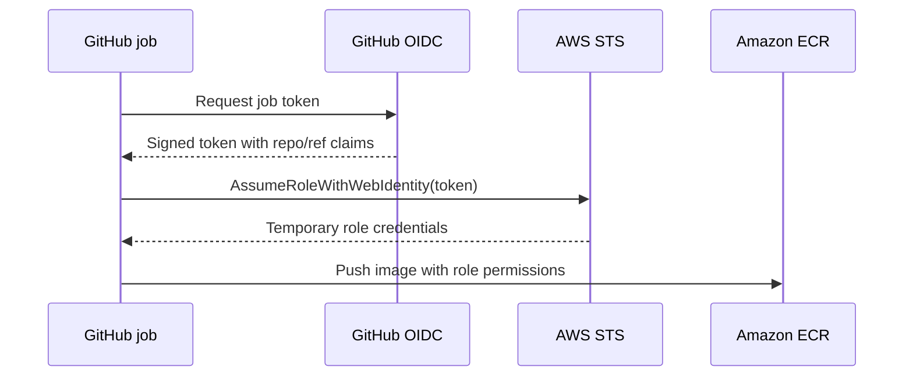
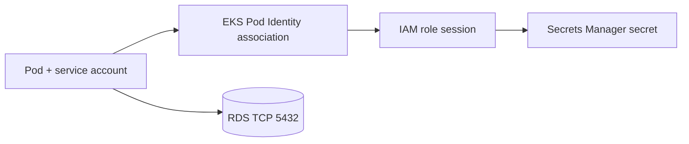

# IAM, STS and identity: a request-level model

Read after [AWS and IAM foundations](../05-aws-iam.md). This chapter follows identities from human login through GitHub deployment and a Pod reading Secrets Manager. It is tied to the [platform Terraform](../../platform/terraform/identity.tf).

## 1. Authentication is not authorization

Authentication answers *who is calling?* Authorization answers *may that caller perform this action on this resource in this context?* An AWS API request has a principal, action, resource and context such as source IP, requested region, tags and session attributes. `aws sts get-caller-identity` helps identify the caller; it does not prove that caller can access S3, EKS or RDS.

The account root identity owns the account. It is not a day-to-day administrator role. Secure root with MFA and keep its use exceptional. A workforce user should normally authenticate through an identity provider into IAM Identity Center and receive temporary role credentials. A machine workload should assume a role rather than store access keys. Credentials represent a session with an expiration; rotating a static secret in a repository is an avoidable operational burden.

## 2. Policies are statements, not role names

An identity policy can allow a role to call `secretsmanager:GetSecretValue` on one ARN. A trust policy allows a specified principal to assume that role. Both are required for the complete path. A resource policy is attached to a supported resource such as an S3 bucket or KMS key; it can grant cross-account access under its own rules. AWS evaluates applicable policy types, including organization guardrails, session policies and permissions boundaries. Explicit deny takes precedence. Resource-based grants have nuances by principal type; do not reduce the entire evaluation to a single “all policies must allow” slogan.

```json
{
  "Version": "2012-10-17",
  "Statement": [{
    "Sid": "ReadOnlyOneSecret",
    "Effect": "Allow",
    "Action": "secretsmanager:GetSecretValue",
    "Resource": "arn:aws:secretsmanager:eu-west-1:123456789012:secret:app-db-EXAMPLE"
  }]
}
```

`Effect` selects Allow or Deny. `Action` names API operations. `Resource` scopes object ARNs where the service supports resource-level permission. `Condition` narrows a statement, for example to an OIDC audience or a source VPC endpoint. `Action: "*"` on `Resource: "*"` is broad administrative power and should not be used to silence a specific denial.

## 3. Temporary credentials and STS

`AssumeRole` returns access key ID, secret key and session token with limited lifetime. They belong to a role *session*, not a new IAM user. The caller needs permission to assume a role; the role trust policy must accept that caller. CloudTrail records role sessions and API events for investigation. Session tags can carry context. A long-lived key in CI creates a secret distribution and rotation problem; OIDC lets CI trade a signed, short-lived identity token for AWS credentials.



In [identity.tf](../../platform/terraform/identity.tf), the OIDC trust policy requires audience `sts.amazonaws.com` and a subject containing the exact GitHub repository and `main` branch. Changing branch, repository name or using a GitHub environment subject changes the claim and can make assumption fail. Deployment permissions allow ECR push and cluster description; a separate EKS access entry grants Kubernetes edit access within namespace `platform`. AWS IAM permission to call `eks:DescribeCluster` does **not** by itself grant Kubernetes API authorization.

## 4. Pod Identity and the two authorization layers

The API Pod uses service account `platform-api`. EKS Pod Identity maps that Kubernetes service account to an IAM role trusted by `pods.eks.amazonaws.com`. The AWS SDK receives temporary credentials and reads the RDS-managed secret. The role policy scopes `GetSecretValue` to the generated secret ARN. The Kubernetes service account does not need the Pod Identity role ARN annotation used by the older IRSA pattern. Separately, Kubernetes RBAC controls calls to the Kubernetes API; the Pod does not need that API token for its application logic.



The secret read and the database TCP connection are different authorizations. `GetSecretValue` can succeed while a security group blocks TCP 5432. Conversely, a TCP connection can succeed while the password is wrong. In this teaching platform, the app uses the RDS master credential to prove integration; create an application-specific database user with limited SQL privileges before using real data.

## 5. Diagnose AccessDenied without expanding privileges

1. Capture the exact error, action, resource ARN and request time. Some services expose enhanced denial context, but not all.
2. Identify the active principal in the *failing process*: local shell, GitHub job or Pod. A working local admin profile says nothing about the CI role.
3. Inspect the role trust when assumption itself fails. Inspect the role's permission policy when the assumed role reaches a service but the service denies an action.
4. Check region, ARN suffixes, conditions, organization SCP/RCP, boundary and resource policy. For KMS-encrypted secrets, inspect key policy and decrypt permission as applicable.
5. Use CloudTrail event history or configured trails for evidence. Test the single operation again after a narrow fix.

| Symptom | Likely layer | Evidence |
| --- | --- | --- |
| GitHub cannot assume deploy role | OIDC trust | Token audience/subject, role ARN, STS error |
| GitHub assumes role but ECR push fails | IAM permissions | Missing ECR action or wrong repository ARN |
| `kubectl` gets forbidden | EKS access entry / Kubernetes auth | Principal ARN, namespace and resource verb |
| Pod gets secret denied | Pod Identity / secret policy | Association, service account, secret ARN |
| Secret works but DB times out | VPC path | Security group, endpoint DNS, RDS status |

## 6. Security and cost decisions

IAM has no substitute for reviewing who can assume each role. Treat `iam:PassRole`, policy modification and wildcard trust as high-impact. Restrict GitHub workflow permissions to jobs needing OIDC. Prefer per-workload roles and per-secret ARNs. Rotate credentials and test consumers; a rotated secret is only safe if applications refresh it. CloudTrail storage and analysis may create charges depending on configuration; inspect current pricing.

## Hands-on reasoning

Without applying anything, inspect [the GitHub trust policy](../../platform/terraform/identity.tf). Write down the exact `sub` claim it accepts. Then change the hypothetical workflow from `main` to a feature branch: predict the STS result. Trace a Pod call to Secrets Manager and list all four objects involved: Pod, service account, association and IAM role.

## Knowledge check

1. Why can an authenticated caller receive `AccessDenied`?
2. Which policy answers *who may assume this role* and which answers *what may the role do*?
3. Why is EKS access entry required in addition to `eks:DescribeCluster`?
4. If `GetSecretValue` works but `/ready` is 503, what evidence distinguishes networking from SQL authentication?

Official references: [IAM policy evaluation](https://docs.aws.amazon.com/IAM/latest/UserGuide/reference_policies_evaluation-logic.html), [IAM security best practices](https://docs.aws.amazon.com/IAM/latest/UserGuide/best-practices.html), [EKS Pod Identity](https://docs.aws.amazon.com/eks/latest/userguide/pod-id-association.html), [GitHub OIDC for AWS](https://docs.github.com/en/actions/how-tos/secure-your-work/security-harden-deployments/oidc-in-aws).
