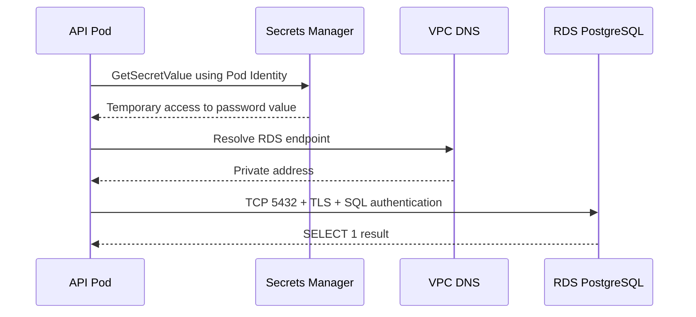

# RDS PostgreSQL: network, identity, storage and recovery

Read [compute, storage and databases](../07-compute-data.md) first. A managed database removes work such as host provisioning and some maintenance; it does not design your schema, tune queries, choose privileges or prove a restore works. The [platform RDS instance](../../platform/terraform/database.tf) is a single-AZ, private PostgreSQL instance suitable for a disposable learning environment. It is not a high-availability production database.

## 1. What exists behind an RDS endpoint

RDS creates a database instance with compute, attached storage, an endpoint name and network interfaces in the chosen VPC. The DB subnet group supplies subnets in different AZs so RDS has placement options. An instance currently runs in one AZ unless Multi-AZ is enabled. The endpoint is a DNS name; clients should use the name rather than caching an IP indefinitely, particularly around failover. The database port for PostgreSQL is commonly 5432. `publicly_accessible = false` keeps the endpoint private; the security group controls permitted sources.

The Pod's IAM role authorizes the secret read. PostgreSQL authentication is separate and uses credentials stored in the secret. A security group allows the TCP connection from private EKS subnet CIDRs. TLS encrypts the database connection; the application uses `sslmode=require`, which encrypts but does not verify the server certificate identity. A stricter production client should use `verify-full` with the current RDS CA bundle and test certificate rotation.

## 2. Credential lifecycle

`manage_master_user_password = true` asks RDS to generate and store the master password in Secrets Manager. Terraform receives the secret ARN, not the password. The platform's Pod Identity role may read that one secret. The demo app retrieves it at readiness time and connects to `platform`. This proves the path, but a master user has excessive database privilege for an application. Before real workloads: create a dedicated SQL role with only required schema/table privileges, choose a controlled credential lifecycle and rotate it with tested application behavior.

Secret access has both permission and cost implications. Fetching the secret for every readiness probe is acceptable for a teaching demonstration but inefficient at scale; real services should cache credentials appropriately, handle rotation and avoid leaking secret values to logs. Secrets Manager access can fail independently of RDS availability. The readiness endpoint deliberately reports 503 for either failure and logs only the exception class, not the secret.

## 3. Storage, backup and deletion

The example allocates 20 GiB of encrypted storage and permits storage autoscaling up to 100 GiB. Autoscaling can increase the billed storage; it does not automatically shrink it. Backup retention is seven days. A backup policy is incomplete until a restore drill proves recovery time and data integrity. `deletion_protection` defaults to true in Terraform; the example tfvars turns it off for a disposable lab. `final_snapshot_identifier` is a separate choice: leave it null to skip a final snapshot, or set a unique name and apply before destroy to retain one. A retained snapshot may remain billable after instance deletion. Never remove Terraform state as a substitute for destroying the instance.

Backups and snapshots do not prevent a bad schema migration or a malicious write from reaching the database. Define recovery point and recovery time objectives, test point-in-time restore where supported and verify application compatibility with the restored state.

## 4. Multi-AZ, read replicas and Aurora

A Multi-AZ **DB instance** has a synchronous standby in another AZ for failover; that standby does not serve reads. A read replica is a separate read-scaling component, often asynchronous and potentially lagging. A Multi-AZ **DB cluster** has a different layout and can serve reads from standby instances. These are distinct RDS options. Aurora is a separate managed relational engine family with its own storage and failover design. Choose after measuring availability, latency, query and budget needs; do not toggle features simply to make a diagram look “production.”

The platform currently has one RDS instance. Even with two EKS replicas, loss of the DB instance can make `/ready` fail for all Pods. A production upgrade should consider Multi-AZ, restore testing, connection pooling and an application behavior for database unavailability.

## 5. Connections and query pressure

Every PostgreSQL connection consumes database resources. If a readiness probe opens a new connection too frequently across many replicas, it can increase connection count. A production application normally uses a bounded pool and a lightweight readiness strategy. RDS Proxy can help with connection management for suitable workloads, but adds another component and charge. Indexes accelerate reads at write and storage cost. Transactions preserve consistent groups of operations; a retry after connection loss must account for whether the transaction committed.

Watch `CPUUtilization`, `FreeStorageSpace`, `DatabaseConnections`, read/write latency and application error rate together. CPU alone does not reveal whether users can complete requests. The platform CloudWatch alarms cover CPU and free storage; they are only a baseline. SNS email requires subscription confirmation before alerts reach a person.

## 6. Failure diagnosis by error type

| Error | Likely boundary | Inspect |
| --- | --- | --- |
| DNS lookup fails | Resolver / endpoint | Endpoint string, VPC DNS settings |
| TCP timeout | Route / SG / NACL / instance | Source context, SG rule, RDS status |
| Connection refused | Listener / port / status | Endpoint, port, RDS event and engine state |
| TLS error | Trust or protocol | CA, hostname, client `sslmode`, rotation |
| Authentication failed | SQL identity | Username, secret version, DB role |
| Too many connections | Capacity / pool | `DatabaseConnections`, pool limits, idle sessions |
| Slow query | SQL / indexes / I/O | Query plan, lock waits, I/O metrics |

Run connectivity checks *inside the same network context as the Pod*. A laptop's success or failure does not prove the Pod path. `nc` confirms TCP only; a successful SQL query confirms more layers. Avoid copying credentials into shell history or ticket comments. Use the [database connectivity runbook](../../runbooks/database-connectivity.md) during incident triage.

## Hands-on reasoning

Inspect [database.tf](../../platform/terraform/database.tf) and [the application](../../platform/app/app.py). List each dependency of `/ready`: Kubernetes Pod, Pod Identity, STS credentials, Secrets Manager, VPC DNS, security group, RDS and PostgreSQL authentication. Remove one dependency hypothetically and predict the error class and where you would see evidence.

## Knowledge check

1. Why does private RDS still need SQL authentication?
2. What is the difference between Multi-AZ standby and a read replica?
3. Why is `sslmode=require` weaker than `verify-full`?
4. Why can all Pods become unready when a single database fails?
5. What must you verify after a snapshot restore, besides RDS status being “available”?

Official references: [RDS user guide](https://docs.aws.amazon.com/AmazonRDS/latest/UserGuide/Welcome.html), [Multi-AZ deployments](https://docs.aws.amazon.com/AmazonRDS/latest/UserGuide/Concepts.MultiAZ.html), [RDS-managed passwords](https://docs.aws.amazon.com/AmazonRDS/latest/UserGuide/rds-secrets-manager.html), [RDS best practices](https://docs.aws.amazon.com/AmazonRDS/latest/UserGuide/CHAP_BestPractices.html).
