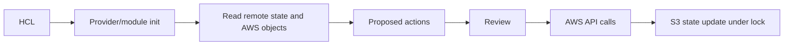
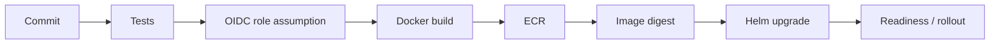

# Terraform, state, GitHub Actions and the release boundary

Read [Terraform basics](../09-terraform.md) and [CI/CD basics](../10-delivery.md). This chapter follows one platform change through a plan, AWS APIs, an image build and a Kubernetes rollout. It also explains why infrastructure state and application releases must be controlled separately.

## 1. Terraform does not store “the cloud”

Terraform configuration describes desired resources. Providers call AWS APIs. State records Terraform resource addresses, remote object IDs and some attributes, allowing the next plan to compare configuration with observed infrastructure. State may contain sensitive values even when variables or outputs are marked sensitive; protect the backend and local plan files. `terraform fmt` checks style, `validate` checks configuration structure, `plan` computes a proposed change, and `apply` performs it. None is a substitute for checking the correct AWS account and human impact.

The platform has two Terraform roots. [state-bootstrap](../../platform/state-bootstrap/main.tf) creates an S3 bucket with versioning, encryption and public access blocking. Its initial state is local and must be backed up securely. [platform/terraform](../../platform/terraform/versions.tf) uses that bucket as its S3 backend with lock files. The bucket must exist before initializing the main root. S3 `use_lockfile = true` prevents concurrent writers to the same state key. DynamoDB-based locking is deprecated for new S3 backend setups. Bucket versioning allows recovery from some state mistakes, but recovery itself needs a tested procedure and access control.

## 2. A plan is a review artifact

`terraform plan -out=platform.tfplan` freezes a proposal for later apply. Review additions, updates, replacements and deletions. A resource replacement may mean outage or data loss. Check account, region, names, CIDRs, public exposure, IAM policy diff and RDS deletion behavior. A plan file can contain sensitive data and is ignored by Git; do not upload it to a public PR artifact. Replan when configuration, state or remote reality changes materially. Apply the saved plan only in the intended environment.

Terraform modules package related resources. The platform uses published VPC and EKS modules with constrained major versions and a committed dependency lock file. A version constraint allows compatible updates within a major series; an upgrade still deserves a reviewed plan and test. The RDS, ECR and IAM resources remain visible in the root so a learner can follow their dependencies.

## 3. Drift and ownership

If someone edits an RDS security group in the AWS console, Terraform may propose to return it to code-defined state. Do not blindly apply: determine whether the manual change was an emergency fix, unauthorized drift or a desired new rule. Bring intended changes into code, review, then reconcile. Some resources created by Kubernetes controllers, such as the NLB, are not in Terraform state. Their owner is the Kubernetes Service. Delete the Service before tearing down the VPC. A Terraform destroy cannot clean up resources it does not own.

## 4. GitHub OIDC deployment path

The [workflow](../../.github/workflows/deploy-platform.yml) runs tests, assumes a narrowly scoped AWS role through GitHub OIDC, builds an image, pushes to ECR, retrieves its digest and upgrades the [Helm chart](helm-charts.md). Environment variables such as cluster name and secret ARN are identifiers, not passwords. The workflow requests `id-token: write` only on the deploy job. The trust policy matches the exact repository and `main` branch. Production use should add GitHub environment reviewers and branch protection.

The image tag includes commit and workflow run information so reruns do not collide with immutable ECR tags. The Kubernetes Deployment uses `repository@sha256:...`, which identifies exact content. Helm waits for readiness and runs a test hook; neither proves public DNS/TLS or a complete user journey. The [platform guide](../../platform/README.md) adds external smoke checks. A release pipeline should eventually verify a real transaction and alert state before promotion.

## 5. Rollback and database compatibility

`helm rollback` can restore an earlier chart and values revision, but it cannot undo a database schema migration, deleted data or a changed external API. Use expand-and-contract schema changes: add backward-compatible fields, deploy code that understands both versions, migrate data, then remove old fields in a later release. Store release digest and migration version. During an incident, decide whether rollback is safe before executing it. Verify user traffic after any rollback.

## 6. Destroy as a planned change

The platform's default RDS deletion protection is true. A disposable lab can set it false deliberately. ECR refuses deletion while images remain because `force_delete = false`. Kubernetes owns the NLB and must remove it before VPC teardown. State bucket has `prevent_destroy`. These are intentional friction points: each asks you to identify what data or billing remains. A final RDS snapshot and S3 object versions can continue incurring charges. Always inspect AWS after destroy rather than assuming the Terraform summary covers every resource.

## Hands-on reasoning

Read [network.tf](../../platform/terraform/network.tf), [cluster.tf](../../platform/terraform/cluster.tf) and [the deploy workflow](../../.github/workflows/deploy-platform.yml). Write an ownership table for VPC, NLB, image and Pod. Then imagine an engineer deletes the NLB in AWS without deleting the Service: predict which controller might recreate it and which source of truth should be changed.

## Knowledge check

1. What does state contain that configuration does not?
2. Why is state locking needed even with pull request review?
3. Why is a container digest safer for rollback than a mutable tag?
4. Which resources does `terraform destroy` not own in this platform?
5. What evidence is missing after `kubectl rollout status` reports success?

Official references: [Terraform state](https://developer.hashicorp.com/terraform/language/state), [S3 backend and lock file](https://developer.hashicorp.com/terraform/language/backend/s3), [GitHub OIDC for AWS](https://docs.github.com/en/actions/how-tos/secure-your-work/security-harden-deployments/oidc-in-aws), [Kubernetes Deployment rollout](https://kubernetes.io/docs/concepts/workloads/controllers/deployment/).
