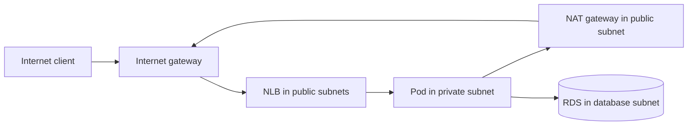

# VPC, subnets and the path of one packet

Read [networking fundamentals](../03-networking.md) first. This chapter connects CIDR, routing and firewalls to [the platform network code](../../platform/terraform/network.tf). A VPC is a regional virtual network; a subnet sits in one Availability Zone. A route table chooses a next hop. A security group filters traffic at attached interfaces. These are separate decisions.

## 1. Address plan

The platform assigns `10.64.0.0/16` to its VPC. It derives two `/24` subnets for each tier: public, private app and database. The `/16` offers 65,536 IPv4 addresses in the mathematical range, but AWS reserves addresses in each subnet and quotas limit actual usable resources. `/24` is 256 addresses mathematically; do not plan 256 Pod IPs in a `/24` without checking EKS networking overhead and AWS reservations.

| Tier | Example range | Intended occupants | Default path |
| --- | --- | --- | --- |
| Public | `10.64.0.0/24` | NAT gateway, internet-facing NLB | Internet gateway |
| Private app | `10.64.20.0/24` | EKS nodes and Pods | NAT gateway for outbound IPv4 |
| Database | `10.64.40.0/24` | RDS network interfaces | No direct Internet route |

There is one subnet of each tier in each of two AZs. Addresses must not overlap with networks that may later connect over VPN or Transit Gateway. AWS's VPC module creates route tables and associations; inspect the Terraform plan or VPC resource map to verify effective routes rather than trusting a subnet name.

## 2. Public versus private is routing plus addressing

A public subnet has a route to an Internet gateway. An EC2 instance there still needs a public address and a security rule to receive traffic. A private subnet has no direct Internet gateway route. A NAT gateway in a public subnet lets private sources initiate outbound IPv4 connections; it does not accept unsolicited inbound Internet connections to those sources.

Return traffic from a NAT-initiated connection is translated back to the private source. The app-to-RDS path stays inside the VPC and does not need NAT. ECR image pulls, AWS API calls and package downloads may use NAT unless suitable VPC endpoints and routes exist. S3 gateway endpoints and interface endpoints can reduce some NAT use, but each endpoint has its own cost, policy and DNS behavior. The platform chooses one NAT for a lower-cost learning environment; loss of its AZ may interrupt outbound paths from the other AZ. A production design should assess per-AZ NAT and endpoints against its availability and cost targets.

## 3. Subnet tags and EKS Auto Mode

EKS Auto Mode needs subnet role tags to discover load balancer placement. `kubernetes.io/role/elb=1` marks public load balancer subnets; `kubernetes.io/role/internal-elb=1` marks private ones. The platform applies these tags in [network.tf](../../platform/terraform/network.tf). The Kubernetes Service requests an internet-facing NLB. Its targets are Pod IPs in private app subnets. A public load balancer does **not** require public Pods.

## 4. Security group versus network ACL

A security group attaches to an elastic network interface and is stateful: a permitted request normally allows return traffic without a separate reverse rule. A network ACL is applied at a subnet boundary and is stateless; both directions need relevant rules. The platform creates an RDS security group that allows TCP 5432 from the private app subnet CIDRs. That is narrower than `0.0.0.0/0`, but broader than a dedicated workload security group. Pod IPs can vary, so the CIDR rule works for the teaching architecture. In a stricter design, evaluate security groups for Pods or another supported identity-aware network control.

Route tables and security groups solve different problems. A route can exist while the security group rejects packets. An allow rule can exist while no route reaches the destination. DNS resolution is another independent step. If a client uses the wrong hostname, no firewall change fixes the application contract.

## 5. Trace browser → API → database

1. Browser resolves a DNS name to NLB addresses. With the optional domain setup, Route 53 serves a CNAME for a subdomain.
2. Browser opens TCP 443 or 80. On HTTPS, the NLB presents an ACM certificate and terminates TLS; traffic from NLB to Pod is HTTP in this example. Production designs with end-to-end encryption need separate backend TLS.
3. NLB chooses a healthy target IP. The Kubernetes Service selector identifies the API Pods; readiness controls whether they should receive traffic.
4. The API uses the RDS endpoint name. VPC DNS resolution yields a private address. The Pod connects to TCP 5432; the RDS security group allows its private subnet CIDR.
5. PostgreSQL checks username/password and processes `SELECT 1`. The response returns through established connections.

## 6. Diagnose the exact failing hop

| Observation | Next check |
| --- | --- |
| DNS name does not resolve | Hosted zone, record, resolver, propagation |
| DNS resolves, TCP times out | NLB status, route, SG/NACL, target health |
| NLB exists, no targets | Service selector, Pod readiness, subnet tags, Auto Mode events |
| Pod `/health` works, `/ready` fails | Pod Identity, Secrets Manager, RDS endpoint/SG/status |
| TCP 5432 works, SQL login fails | Secret version, DB user, TLS mode, database name |

Use VPC Flow Logs for flow metadata when configured; they do not contain HTTP paths or SQL queries. Check `kubectl describe service` for controller events and AWS target-group health for NLB behavior. `ping` is not a dependable test of a TCP application: ICMP can be blocked while TCP works.

## Hands-on reasoning

Without creating resources, inspect [network.tf](../../platform/terraform/network.tf), [database.tf](../../platform/terraform/database.tf) and [the Service template](../../platform/chart/templates/service.yaml). Draw each subnet and route. Predict what breaks if the NAT gateway is deleted. Then predict what breaks if the RDS SG ingress is removed. The two failures affect different paths.

## Knowledge check

1. Why can a public NLB reach private Pods?
2. Does a NAT gateway create inbound Internet access to RDS?
3. Which control would you inspect first for a TCP timeout from Pod to RDS?
4. Why does a single NAT gateway undermine a two-AZ availability claim for outbound traffic?
5. What happens when a route and a security-group rule disagree?

Official references: [VPC route tables](https://docs.aws.amazon.com/vpc/latest/userguide/VPC_Route_Tables.html), [NAT gateways](https://docs.aws.amazon.com/vpc/latest/userguide/vpc-nat-gateway.html), [security groups](https://docs.aws.amazon.com/vpc/latest/userguide/vpc-security-groups.html), [EKS subnet tags](https://docs.aws.amazon.com/eks/latest/userguide/tag-subnets-auto.html).
