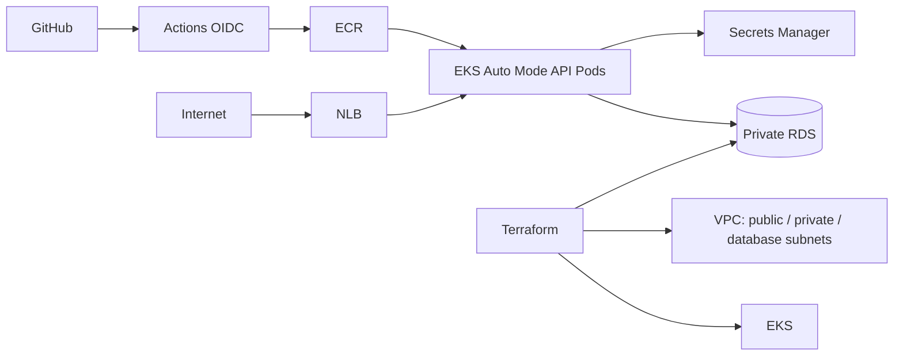

# Deployable AWS platform

Before provisioning, follow the [service map](../docs/services/aws-service-map.md) and deep dives on [IAM](../docs/services/iam-sts-identity.md), [VPC](../docs/services/vpc-traffic.md), [EKS](../docs/services/eks-workloads.md), [Helm](../docs/services/helm-charts.md), [RDS](../docs/services/rds-data.md), [Terraform/delivery](../docs/services/terraform-delivery.md), [DNS/TLS](../docs/services/dns-tls-load-balancing.md) and [operations](../docs/services/observability-operations.md). Each explains the matching platform files, failure paths and tradeoffs.

This directory turns the handbook's architecture into an implementable path: two-AZ VPC → private EKS Auto Mode workloads → private PostgreSQL RDS → ECR → GitHub OIDC deployment → public NLB. Optional ACM/Route 53 adds a TLS hostname. CloudWatch supplies RDS alarms and a dashboard; SNS email delivery is optional. The API proves access to RDS through Pod Identity and an RDS-managed Secrets Manager password. The infrastructure is **not deployed by this repository's CI**; no AWS account is configured here.



## Before any apply

**Charges start with EKS, Auto Mode compute, NAT gateway, NLB, RDS, ECR and data transfer.** Inspect [current AWS pricing](https://aws.amazon.com/pricing/) for your region. Use a disposable account, budget alerts and a federated administrator role; verify `aws sts get-caller-identity`. You need Terraform 1.10+, AWS CLI, kubectl, Helm 3/4, gh, Python 3.10+ and Docker only for local builds. AWS CLI and Docker were unavailable in the authoring environment; no live deployment was run.

Read the [AWS EKS Auto Mode guide](https://docs.aws.amazon.com/eks/latest/userguide/automode.html), [RDS password management](https://docs.aws.amazon.com/AmazonRDS/latest/UserGuide/rds-secrets-manager.html), [GitHub OIDC guide](https://docs.github.com/en/actions/how-tos/secure-your-work/security-harden-deployments/oidc-in-aws) and [S3 backend](https://developer.hashicorp.com/terraform/language/backend/s3) before production adaptation. This design uses one NAT gateway for cost; that is a single-AZ outbound dependency. It uses one RDS instance rather than Multi-AZ and a public EKS API endpoint for bootstrap. Tighten these for a production reliability/security target. The app uses the RDS master credential to demonstrate the full chain; create a separate low-privilege database user before using it for real application data.

## 1. Create protected remote state

Choose a globally unique state bucket name. Bootstrap it once, in a directory whose **local state you will back up securely**. Never commit state or secrets.

```sh
cd platform/state-bootstrap
terraform init
terraform apply -var='aws_region=eu-west-1' -var='bucket_name=YOUR-UNIQUE-STATE-BUCKET'
cd ../..
```

The bucket has versioning, server-side encryption and public access blocking. Restrict IAM access to the state key and lock file. The bucket has `prevent_destroy`; retain it while the platform exists. State locking uses an S3 lock file.

## 2. Plan and create infrastructure

Copy `platform/terraform/terraform.tfvars.example` to `terraform.tfvars`, set your own `github_repository`, region and name. `terraform.tfvars` is ignored. The example disables deletion protection for a disposable lab; the Terraform default enables it. For optional HTTPS, set `domain_name` to a **subdomain** in an existing public Route 53 hosted zone plus `route53_zone_id`. ACM validates via a DNS record created by Terraform. For HTTP-only lab, leave both empty.

```sh
cd platform/terraform
terraform init -backend-config='bucket=YOUR-UNIQUE-STATE-BUCKET' -backend-config='key=devops-platform/terraform.tfstate' -backend-config='region=eu-west-1'
terraform fmt -check
terraform validate
terraform plan -out=platform.tfplan
# Review identity, cost, security groups, public endpoint, resource count.
terraform apply platform.tfplan
terraform output
cd ../..
```

If your AWS account already has the GitHub Actions OIDC provider, import it into Terraform state or adapt `identity.tf` to reference the existing provider before apply. Do not create a duplicate provider. EKS version and RDS class availability vary by region. Confirm with AWS before selecting them. The plan may need permissions for VPC, EKS, EC2, IAM, RDS, ECR, ACM and Route 53.

If `alert_email` is set, confirm the SNS subscription email. Until confirmation, alarms have no delivered recipient. The CloudWatch dashboard and alarms cover the RDS layer; add application request metrics, central logs and SLO alerts before treating this as a production monitoring stack.

## 3. Bootstrap namespace and GitHub environment

The Terraform caller receives cluster admin access for bootstrap. CI receives edit access **only** to namespace `platform`. Create the namespace once with the Terraform caller:

```sh
aws eks update-kubeconfig --region eu-west-1 --name "$(terraform -chdir=platform/terraform output -raw cluster_name)"
kubectl create namespace platform
bash platform/scripts/configure_github.sh
```

The script saves non-secret resource identifiers as GitHub environment variables; it does not copy DB passwords. In GitHub repository settings, add required reviewers to environment `platform` for production use. Check the OIDC trust condition in `identity.tf`: only this repository's `main` branch can assume the deploy role. The deployment workflow is manual so an incomplete bootstrap never deploys automatically.

## 4. Deploy API

Run `gh workflow run deploy-platform.yml`, approve its environment gate if configured, then `gh run watch`. CI tests the API, builds and pushes a uniquely tagged image, resolves its immutable digest, upgrades the [Helm chart](chart/README.md), waits for rollout and runs `helm test`. Auto Mode provisions a public NLB from the Service. ECR images are scanned on push; review scan findings as part of release review.

```sh
kubectl get pods,service,endpointslices -n platform
kubectl logs deployment/platform-api -n platform --tail=50
kubectl get service platform-api -n platform -o jsonpath='{.status.loadBalancer.ingress[0].hostname}'
```

Without TLS, call `http://NLB_HOST/health` and `http://NLB_HOST/ready`. `/ready` returns 200 only when Pod Identity → Secrets Manager → private RDS `SELECT 1` succeeds. With TLS, CI renders a 443 listener using the ACM certificate ARN. After the NLB hostname appears, run `DOMAIN_NAME=api.example.com ROUTE53_ZONE_ID=Z... python3 platform/scripts/publish_dns.py` from the repository root (requires `boto3`); then call `https://api.example.com/ready`. The DNS helper creates a CNAME, so use a subdomain rather than the zone apex. Wait for DNS propagation.

## Failure checks

| Symptom | Start here |
| --- | --- |
| `AccessDenied` in Actions | Confirm environment vars, OIDC `sub`, IAM role and EKS access entry |
| Pod pending | `kubectl describe pod`; Auto Mode node provisioning, quotas, private subnet routes |
| `/ready` returns 503 | Pod logs; Pod Identity association, secret ARN, RDS SG, endpoint and database status |
| NLB hostname absent | `kubectl describe svc`; public subnet tags, Auto Mode status, AWS quotas |
| TLS fails | ACM validation, certificate ARN/region, DNS name, NLB listener |
| Rollout fails | `helm history platform-api -n platform`, Pod events/logs; use [rollback runbook](../runbooks/deployment-rollback.md) |

## Destroy without orphaned charges

1. Stop new deploys. Remove optional DNS CNAME via Route 53 console or CLI.
2. Run `helm uninstall platform-api -n platform`; wait until the AWS NLB is gone. Inspect failed test hook Pods if present, then delete namespace `platform`.
3. Delete all images in the ECR repository (it has `force_delete = false`).
4. Decide whether to retain a final DB snapshot. Set `final_snapshot_identifier` to a new, unique name in `terraform.tfvars` to create one; `null` skips it. Review and apply that change before destroy. If `deletion_protection = true`, intentionally change it to `false` and apply a reviewed plan first. These are separate choices. A retained snapshot can incur charges and is not removed by this Terraform destroy.
5. From `platform/terraform`, run `terraform plan -destroy`, review, then `terraform destroy`. Confirm RDS, EKS, NAT, NLB, ECR, EIPs and VPC resources are absent in AWS. Protect or retire the state bucket separately after checking object versions and lock files.

Do not delete Terraform state to “clean up”; that leaves live resources untracked. Do not run destroy against an account with unrelated resources or an environment still serving users.
